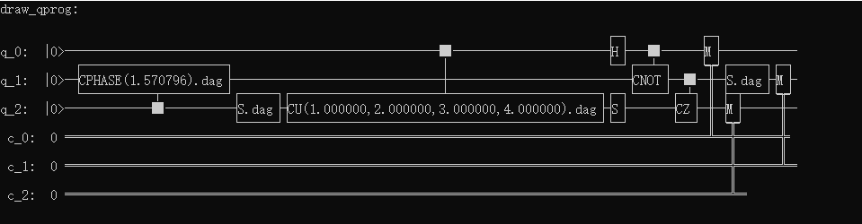

量子线路字符画
============

接口draw_qprog()可以将输入的量子程序转换为字符画并输出到控制台同时将字符画信息保存到文件（QCircuitTextPic.txt，该接口会在当前程序运行目录下创建该txt文件，该文件用utf8编码，并覆盖之前数据），
接口详细说明如下：
::
    /**
    * @brief output a quantum prog/circuit to console by text-picture(UTF-8 encode),
             and will save the text-picture in file named QCircuitTextPic.txt in the same time in current path.
    * @param[in] prog  the source prog
    * @param[in] itr_start The start pos, default is the first node of the prog
    * @param[in] itr_end The end pos, default is the end node of the prog
    * @return the output string
    * @ Note: All the output characters are UTF-8 code.
    */
    std::string draw_qprog(QProg &prog, const NodeIter itr_start = NodeIter(), const NodeIter itr_end = NodeIter());
    

实例
---------------

::

    #include "Core/QPanda.h"
    #include <iostream>
    #include <vector>
    #include "Core/Utilities/QProgInfo/Visualization/QVisualization.h"
    #include "Core/Utilities/Tools/FillQProg.h"
    #include "Core/Core.h"
    #include <fstream>
    USING_QPANDA

    int main(void)
    {
        auto machine = initQuantumMachine(QMachineType::CPU);
	auto q = machine->allocateQubits(3);
	auto c = machine->allocateCBits(3);
	QProg prog;
	QCircuit cir2;
	QCircuit cir1;

	auto gate = S(q[1]);
	gate.setDagger(true);

	cir1 << H(q[0]) << S(q[2]) << CNOT(q[0], q[1]) << CZ(q[1], q[2]) << gate;
	cir1.setDagger(true);
	cir2 << cir1 << CU(1, 2, 3, 4, q[0], q[2]) << S(q[2]) << CR(q[2], q[1], PI / 2);
	cir2.setDagger(true);
	prog << (cir2) << (MeasureAll(q, c));

        //字符画输出
	string text_picture = draw_qprog(prog);
	cout << "draw_qprog:" << endl << text_picture << endl;

	destroyQuantumMachine(machine);
    }

以上示例演示了draw_qprog这个接口的使用方法，上述代码的输出结果如下：

在实际使用过程中，为了方便调用，我们重载了标准输出std::cout，所以以下两部分代码是等价的：

::

    //普通方法打印字符画
    string text_picture = draw_qprog(prog);
    cout << text_picture << endl;
    
    //通过重载cout，进行字符画打印
    cout << prog << endl;
    

用户在实际使用过程中，也可以通过传入迭代器参数，输出某个量子程序中指定程序段的字符画，我们可以将上述示例代码中，字符画输出部分做如下修改：
::

    auto itr1 = cir1.getFirstNodeIter();
    auto itr2 = cir1.getLastNodeIter();
    
    string text_picture = draw_qprog(prog, itr1, itr2);
    cout << "draw_qprog:" << endl << text_picture << endl;

上述代码段中，在打印线路字符画时，指定了两个迭代器itr1, itr2，最终输出的应该只是子线路cir1的字符画结果。用户可自行替换上述代码段到前面的示例程序中，运行查看结果，这里不再赘述。
