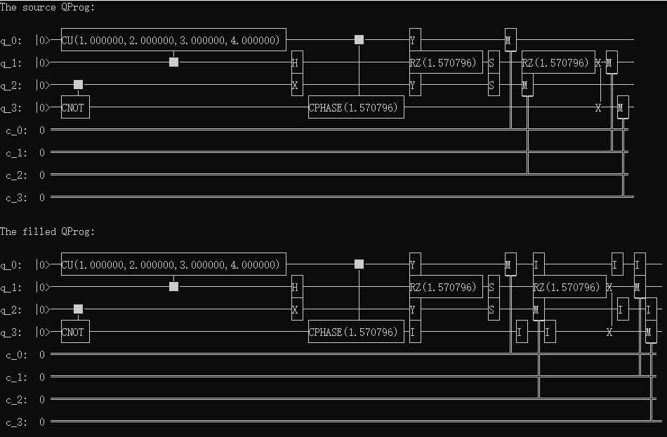

用I门填充QProg
===============

接口fill_qprog_by_I实现用I门填充QProg(量子程序)的功能。

实例
---------------

::

    #include "Core/QPanda.h"
    USING_QPANDA

    int main(void)
    {
	auto qvm = initQuantumMachine(QMachineType::CPU);
	auto q = qvm->allocateQubits(4);
	auto c = qvm->allocateCBits(4);

	QCircuit cir;
	QProg prog;
	cir << CNOT(q[2], q[3]) << CU(1, 2, 3, 4, q[1], q[0]) << (H(q[1])) << X(q[2]) << RZ(q[1], PI / 2) << Y(q[2])
		<< (CR(q[0], q[3], PI / 2)) << (S(q[2])) << S(q[1]) << RZ(q[1], PI / 2) << Y(q[0]) << SWAP(q[3], q[1]);
	prog << cir << MeasureAll(q, c);

	//output source QProg
	cout << "The source QProg:" << endl;
	cout << prog << endl;

	auto filled_prog = fill_qprog_by_I(prog);

	//output the QProg which filled by I-gate
	cout << "The filled QProg:" << endl;
	cout << filled_prog << endl;

	destroyQuantumMachine(qvm);
        return 0;
    }
    
以上示例程序演示了fill_qprog_by_I接口的使用方法，我们可以看到只需要传入一个QProg类型的参数即可，该接口返回一个填充后的新QProg，输入QProg保持不变。
以上示例程序的字符画展示输出结果如下：

