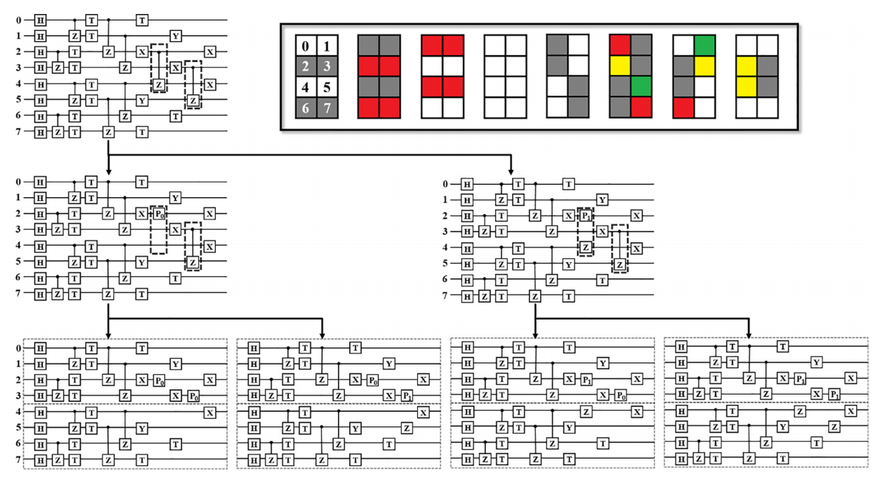

.. _部分振幅量子虚拟机:

部分振幅量子虚拟机
===============
----

部分振幅量子虚拟机的基本思想是将大比特的量子程序拆分成若干个小比特量子程序，每个小比特量子线路使用全振幅算法计算，量子程序的拆分规则如下：
若量子线路中出现跨节点的双量子逻辑门，则对量子程序进行拆分。即以量子程序中量子比特数为总量子比特数的一半或接近一半为分界线，例如总量子比特数为10，则4号比特与5号比特之间为分界线。
双量子逻辑门的控制位量子比特与目标位量子比特分别处于界线的两侧，称为跨节点，例如总量子比特数为10，CNOT(1,5)为跨节点，CNOT(1,4)则没有跨节点。

部分振幅量子虚拟机根据算法要求，对于跨节点双量子逻辑门，如CNOT、CZ等，可以将其拆分为P0、P1和基础单量子逻辑门的组合，对于其他双量子逻辑门，如CR、iSWAP、SqiSWAP等，
可以通过量子逻辑门转化算法将其转换成单量子逻辑门和支持拆分的双量子逻辑门的组合，再对双量子逻辑门进行拆分，拆分过程的示例图如下：

使用介绍
>>>>>>>>>>>>>>>>
----

QPanda2中设计了 ``PartialAmplitudeQVM`` 类用于运行部分振幅模拟量子计算，同时提供了相关接口，它的使用很简单。

首先构建一个部分振幅量子虚拟机

    .. code-block:: c

        auto machine = new PartialAmplitudeQVM();

然后必须使用 ``PartialAmplitudeQVM::init()`` 初始化量子虚拟机环境

    .. code-block:: c

        machine->init();

接着进行量子程序的构建、装载工作

    .. code-block:: c

        auto prog = QProg();
        auto qlist = machine->qAllocMany(10);

        for_each(qlist.begin(), qlist.end(), [&](Qubit *val) { prog << H(val); });
        prog << CZ(qlist[1], qlist[5]) << CZ(qlist[3], qlist[5]) << CZ(qlist[2], qlist[4]);
        ...
        machine->run(prog);

构建还可以采用另一种方式，即读取OriginIR语法文件形式，例如

    .. code-block:: c

        machine->run("D:\\OriginIR");

最后调用计算接口，我们设计多种返回值的接口用于满足不同的计算需求，具体见示例所述：

实例
>>>>>>>>>>
----

.. _部分振幅示例程序:
以下示例展示了部分振幅量子虚拟机接口的使用方式

    .. code-block:: c

        #include "QPanda.h"
        USING_QPANDA

        int main(void)
        {
            auto machine = new PartialAmplitudeQVM();
            machine->init();

            auto qlist = machine->qAllocMany(10);

            auto prog = QProg();
            for_each(qlist.begin(), qlist.end(), [&](Qubit *val) { prog << H(val); });
            prog << CZ(qlist[1], qlist[5])
                 << CZ(qlist[3], qlist[7])
                 << CZ(qlist[0], qlist[4])
                 << RZ(qlist[7], PI / 4)
                 << RX(qlist[5], PI / 4)
                 << RX(qlist[4], PI / 4)
                 << RY(qlist[3], PI / 4)
                 << CZ(qlist[2], qlist[6])
                 << RZ(qlist[3], PI / 4)
                 << RZ(qlist[8], PI / 4)
                 << CZ(qlist[9], qlist[5])
                 << RY(qlist[2], PI / 4)
                 << RZ(qlist[9], PI / 4)
                 << CR(qlist[2], qlist[7], PI / 2);
                
            machine->run(prog);
            auto res = machine->getQState();
            cout << res["0000000000"] << endl;
            cout << res["0000000001"] << endl;

上述程序使用的接口为getQState()，即获取量子态所有分量的振幅，计算结果如下

    .. code-block:: c

        (-0.00647209,-0.00647209)
        (8.5444e-18,-0.00915291)
        ...

若使用其他接口：
    - ``PMeasure(std::string)`` ,输入的参数表示获取测量所有比特构成量子态的概率的结果集的前多少项，比如如下例子，我们获取所有量子态的概率分布结果的前6项，程序运行如下：

        .. code-block:: c

            auto res = machine->PMeasure("6");
            for (auto val :res)
            {
                std::cout << val.first << " : " << val.second << std::endl;
            }

        结果输出如下，每个结果的序号表示量子态的下标，后面的值表示概率：

        .. code-block:: c

            0 : 8.37758e-05
            1 : 8.37758e-05
            2 : 8.37758e-05
            3 : 8.37758e-05
            4 : 0.000488281
            5 : 0.000488281

    - ``PMeasure(QVec,std::string)`` ,输入的第一个参数表示选取哪几个量子比特构成的量子态的概率，第二个参数表示选取结果的前多少项，使用示例如下：

        .. code-block:: c

            QVec qv = { qlist[1],qlist[2],qlist[3] ,qlist[4] ,qlist[5] ,qlist[6] ,qlist[7] ,qlist[8],qlist[9] };
            auto res2 = machine->PMeasure(qv, "6");

            for (auto val :res)
            {
                std::cout << val.first << " : " << val.second << std::endl;
            }

        结果输出如下，每个结果的序号表示量子态的下标，后面的值表示概率：

        .. code-block:: c

            0 : 0.000167552
            1 : 0.000167552
            2 : 0.000976562
            3 : 0.000976562
            4 : 0.000976562
            5 : 0.000976562

    - ``getProbDict(qvec,std::string)`` ,输入的第一个参数表示选取哪几个量子比特构成的量子态的概率，第二个参数表示选取结果的前多少项，使用示例如下：

        .. code-block:: c

            QVec qvec;
            for_each(qlist.begin(), qlist.end(), [&](Qubit *val) { qvec.emplace_back(val); });

            auto res = machine->getProbDict(qvec,6);
            for (auto val :res)
            {
                std::cout << val.first << " : " << val.second << endl;
            }

        结果输出如下，每个结果的前半部分表示量子态的二进制形式，后面的值表示概率：

        .. code-block:: c

            0000000000 : 8.37758e-05
            0000000001 : 8.37758e-05
            0000000010 : 8.37758e-05
            0000000011 : 8.37758e-05
            0000000100 : 0.000488281
            0000000101 : 0.000488281

    - ``pMeasureBinIndex(std::string)`` ,输入的参数表示指定需要测量的量子态二进制形式，使用示例如下：

        .. code-block:: c

            auto res = machine->pMeasureBinIndex("0000000001");
            std::cout << res << std::endl;

        结果输出如下，表示目标量子态的概率值：

        .. code-block:: c

            8.37758e-05

    - ``pMeasureDecIndex(std::string)`` ,输入的参数表示指定需要测量的量子态十进制下标形式，使用示例

        .. code-block:: c

            auto res = machine->pMeasureBinIndex("1");
            std::cout << res << std::endl;

        结果输出如下，表示目标量子态的概率值：

        .. code-block:: c

            8.37758e-05

    - ``pMeasureSubset(QProg &, std::vector<std::string>)`` ,输入的第一个参数表示待运行的量子线路，第二个参数表示需要测量的量子态二进制下标形式构成的子集，使用示例如下：

        .. code-block:: c

            std::vector<std::string> set = { "0000000000","0000000001","0000000100" };
            auto res = machine->PMeasureSubset(prog, set);

            for (auto val : res)
            {
                std::cout << val.first << " : " << val.second << endl;
            }

        结果输出如下：

        .. code-block:: c

            0000000000 : 8.37758e-05
            0000000001 : 8.37758e-05
            0000000100 : 0.000488281

        .. warning::

            1. 部分接口，比如 ``getQState()`` 、 ``PMeasure(std::string)`` 、 ``PMeasure(QVec,std::string)`` 、 ``pMeasureBinIndex(std::string)`` 以及 ``pMeasureDecIndex(std::string)`` 等会在后续的版本中舍弃。
            2. 部分振幅虚拟机会保留 ``pMeasureSubset(QProg &, std::vector<std::string>)`` 接口。
