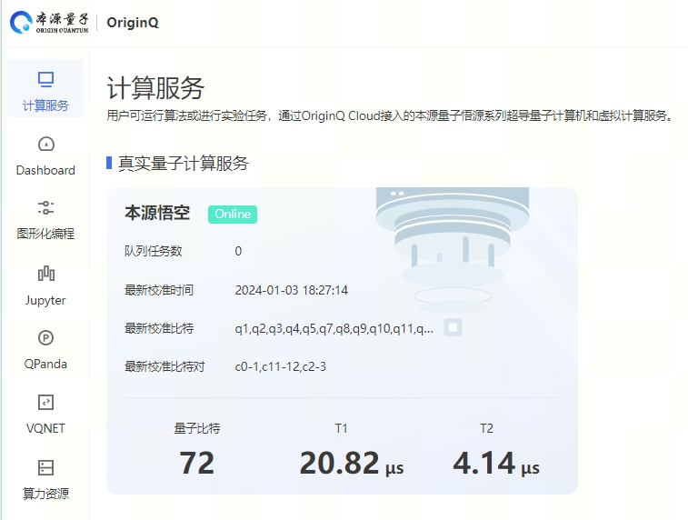

.. _真实芯片计算服务:

真实芯片计算服务
=============================
----

本源悟空超导芯片
>>>>>>>>>>>>>>>>>>>>>>>>>>>>>>

``本源悟空`` 是2024年本源量子正式发布的新一代超导量子计算机，最大运行规模可达72比特，并且在量子计算纠错，运行速度上实现质的飞跃。

对于芯片任务，同样是通过 ``QCloudMachine`` 来提交任务和查询计算计算结果。

用户首先需要通过 **注册并访问** 最新的本源量子云计算官网 `本源量子云 <https://qcloud.originqc.com.cn/>`_ 。

然后点击右上键的 **工作台** ，进入量子计算访问计算界面，

可以看到有各种计算服务，包括虚拟计算和真实量子计算，接着需要进一步获取 **api_token** 等相关信息。 **api_token** 是每个用户用于使用pyqpanda的计算接口访问量子云计算资源的标识符，可以在个人账号中心获取。

    .. image:: images/token.png
        :align: center

 **api_token** 是重要的量子计算资源访问凭证，请妥善保管，量子计算任务的提交和查询，需要通过pyqpanda的量子云组件 ``QCloudMachine`` ，通过将 **api_token** 作为 ``QCloudMachine`` 的初始化函数 **init_qvm** 的参数传递，就可以正常使用后续接口，示例如下：

    .. code-block:: c

        auto machine = QCloudMachine();
        machine.setConfigure({ 72,72 });

        machine.init("502e0201003016072ce3d020106052b8101c04150201010410b6d33ad8772eb9705e844394453a3c8a", true);

量子云组件 ``QCloudMachine`` 的其他接口介绍如下：

.. class:: QCloudMachine(QuantumMachine)

    除了用于与远程计算集群交互， ``QCloudMachine`` 也可以通过提交真实量子计算机芯片任务并获取结果。

    :param QuantumMachine: QuantumMachine类的基类。
    :type QuantumMachine: class
    :ivar origin quantum cloud machine: 该类用于管理远程量子云计算资源。
    :vartype origin quantum cloud machine: std::string

    .. method:: get_state_fidelity(prog : QProg, shot, chip_id=2, is_amend=true, is_mapping=true, is_optimization=true, task_name='QPanda Experiment')

        该方法将给定的量子线路提交到远程真实量子芯片上进行计算，然后返回计算得到的状态保真度。可以通过调整参数来控制计算的方式和行为。

        :param prog: 要计算状态保真度的量子线路。
        :type prog: QProg
        :param shot: 重复运行线路以计算期望值的次数。
        :type shot: int
        :param chip_id: 远程计算集群上的芯片ID，正确默认为72（本源悟空）。
        :type chip_id: int, optional
        :param is_amend: 是否开启读取保真度修正。
        :type is_amend: bool, optional
        :param is_mapping: 是否进行电路映射。
        :type is_mapping: bool, optional
        :param is_optimization: 是否进行优化。
        :type is_optimization: bool, optional
        :param task_name: 任务名称，默认为'QPanda Experiment'。
        :type task_name: std::string, optional
        :return: 计算得到的状态保真度。
        :rtype: float

        
    .. method:: get_state_tomography_density(prog, shot, chip_id=2, is_amend=true, is_mapping=true, is_optimization=true, task_name='QPanda Experiment')

        计算量子线路的qst层析结果。

        :param prog: 要计算态密度矩阵的量子线路。
        :type prog: QProg
        :param shot: 重复运行线路以计算期望值的次数。
        :type shot: int
        :param chip_id: 远程计算集群上的芯片ID，正确默认为72（本源悟空）。
        :type chip_id: int, optional
        :param is_amend: 是否开启读取保真度修正。
        :type is_amend: bool, optional
        :param is_mapping: 是否进行电路映射。
        :type is_mapping: bool, optional
        :param is_optimization: 是否进行优化。
        :type is_optimization: bool, optional
        :param task_name: 任务名称，默认为'QPanda Experiment'。
        :type task_name: std::string, optional
        :return: 计算得到的态密度矩阵。
        :rtype: std::vector<std::vector<complex>>

    .. method:: init(token: std::string, is_logged: bool = false, use_bin_or_hex: bool = true, enable_pqc_encryption = false, std::string random_num = generate_random_hex(96))

        该方法用于初始化 QVM 服务，提供必要的用户身份验证令牌和其他参数。可选参数用于配置 QVM 的行为，例如是否记录操作，以及在处理二进制和十六进制字符串时是否使用默认设置。

        :param token: 用户身份验证令牌。
        :type token: std::string
        :param is_logged: 是否在控制台上记录 QVM 操作（默认为 false）。
        :type is_logged: bool, optional
        :param use_bin_or_hex: 是否在处理二进制和十六进制字符串时使用默认设置（默认为 true）。
        :type use_bin_or_hex: bool, optional
        :param enable_pqc_encryption: 是否启用混合加密算法对数据传输进行加密（默认为 false）
        :type enable_pqc_encryption: bool, optional
        :param random_num: 在enable_pqc_encryption生效的情况，传入的指定随机数，192字符大小的16进制字符串，或者96个字节
        :type random_num: std::string, optional

    .. method:: real_chip_measure(prog, shot, chip_id=2, is_amend=true, is_mapping=true, is_optimization=true, task_name='QPanda Experiment')

        在真实量子计算芯片上进行量子测量。

        :param prog: 要在实际芯片上测量的量子线路。
        :type prog: QProg
        :param shot: 重复运行线路以计算期望值的次数。
        :type shot: int
        :param chip_id: 实际芯片ID，默认为72（本源悟空）。
        :type chip_id: int, optional
        :param is_amend: 是否开启读取保真度修正，默认为true。
        :type is_amend: bool, optional
        :param is_mapping: 是否进行电路映射，默认为true。
        :type is_mapping: bool, optional
        :param is_optimization: 是否进行优化，默认为true。
        :type is_optimization: bool, optional
        :param task_name: 任务名称，默认为'QPanda Experiment'。
        :type task_name: std::string, optional
        :return: 测量结果字典，包含各个测量结果的概率。
        :rtype: std::map<string,double>

    .. method:: async_real_chip_measure(prog, shot, chip_id=2, is_amend=true, is_mapping=true, is_optimization=true, task_name='QPanda Experiment')

        异步在真实量子计算芯片上进行量子测量，后续查询计算结果需要配合 **query_state_result** 使用

        :param prog: 要在实际芯片上测量的量子线路。
        :type prog: QProg
        :param shot: 重复运行线路以计算期望值的次数。
        :type shot: int
        :param chip_id: 实际芯片ID，默认为72（本源悟空）。
        :type chip_id: int, optional
        :param is_amend: 是否开启读取保真度修正，默认为true。
        :type is_amend: bool, optional
        :param is_mapping: 是否进行电路映射，默认为true。
        :type is_mapping: bool, optional
        :param is_optimization: 是否进行优化，默认为true。
        :type is_optimization: bool, optional
        :param task_name: 任务名称，默认为'QPanda Experiment'。
        :type task_name: std::string, optional
        :return: 测量结果字典，包含各个测量结果的概率。
        :rtype: std::map<string,double>

    .. method:: async_batch_real_chip_measure(prog_array, shot, chip_id=RealChipType::ORIGIN_72, is_amend=true, is_mapping=true, is_optimization=true)

        在真实量子计算芯片上批量进行量子测量，后续查询计算结果需要配合 **query_batch_state_result** 使用

        :param prog_array: 要执行的量子程序列表。
        :type prog_array: std::vector<QProg>
        :param shot: 每个程序执行的次数（测量次数）。
        :type shot: int
        :param chip_id: 要使用的真实量子芯片的ID，默认为 RealChipType::ORIGIN_72
        :type chip_id: RealChipType, optional
        :param is_amend: 是否对程序执行修正，默认为true。
        :type is_amend: bool, optional
        :param is_mapping: 是否进行量子比特映射，默认为true。
        :type is_mapping: bool, optional
        :param is_optimization: 是否进行门融合优化，默认为true。
        :type is_optimization: bool, optional
        :return: 批量任务ID。
        :rtype: std::string

    .. method:: batch_real_chip_measure(prog_array, shot, chip_id=RealChipType::ORIGIN_72, is_amend=true, is_mapping=true, is_optimization=true)

        在真实量子计算芯片上批量进行量子测量。

        :param prog_array: 要执行的量子程序列表。
        :type prog_array: std::vector<QProg>
        :param shot: 每个程序执行的次数（测量次数）。
        :type shot: int
        :param chip_id: 要使用的真实量子芯片的ID，默认为 RealChipType::ORIGIN_72
        :type chip_id: RealChipType, optional
        :param is_amend: 是否对程序执行修正，默认为true。
        :type is_amend: bool, optional
        :param is_mapping: 是否进行量子比特映射，默认为true。
        :type is_mapping: bool, optional
        :param is_optimization: 是否进行门融合优化，默认为true。
        :type is_optimization: bool, optional
        :return: 包含每个程序测量结果概率的字典列表。
        :rtype: std::vector<std::map<std::std::stringing, double>>

    .. method::query_state_result(std::string task_id)

        该方法用于查询单个任务的状态和结果。如果任务成功完成，结果列表将包含测量结果

        :param task_id: 要查询的任务ID。
        :type task_id: std::string
        :return: 任务结果。如果任务没有完成会返回空集，出错会抛出异常
        :rtype: std::map<std::string, double>

    .. method:: query_batch_state_result(std::string task_id)

        该方法用于查询批量批量任务的结果。

        :param task_id: 要查询的批量任务ID。
        :type task_id: std::string
        :return: 任务结果。如果任务没有完成会返回空集，出错会抛出异常
        :rtype: std::vector<std::map<std::string, double>>

通过量子云平台向本源悟源请求计算任务的完整代码流程如下：

    .. code-block:: c
        
        #include "QPanda.h"
        USING_QPANDA

        int main(void)
        {
            auto machine = QCloudMachine();
            machine.setConfigure({ 72,72 });

            //online
            machine.init("41241e1414cf1412cf41cf415f1541d412x412c4f1cf", true);

            auto q = machine.qAllocMany(6);
            auto c = machine.cAllocMany(6);

            auto measure_prog = QProg();

            for (size_t i = 0; i < 1024 * 256; i++)
                measure_prog << H(q[0]) << CNOT(q[0], q[1]);

            std::vector<QProg> prog_array;
            for (size_t i = 0; i < 8; i++)
                prog_array.emplace_back(measure_prog);

            auto prog = QProg();
            prog << H(q[1]) << Measure(q[1], c[0]);

            auto batch_result = machine.batch_real_chip_measure(prog_array, 100, RealChipType::ORIGIN_72);
            for (auto val : batch_result)
            {
                for (auto single_item : val)
                    cout << single_item.first << " : " << single_item.second << endl;
            }

            auto real_chip_result = machine.real_chip_measure(measure_prog, 
                1000, 
                RealChipType::ORIGIN_72,
                true,
                true,
                true);

            for (auto val : real_chip_result)
                cout << val.first << " : " << val.second << endl;

            return;
        }
  
    **RealChipType::ORIGIN_72** 表示使用最新的悟空72比特芯片

除了蒙特卡洛测量接口之外，还有用于获取 **量子态qst层析** 结果和 **保真度** 接口，下面逐一介绍：

    -  **获取量子态qst层析结果接口：**  ``get_state_tomography_density`` ,使用示例如下：
 
    .. code-block:: c

        #include "QPanda.h"
        USING_QPANDA

        int main(void)
        {
            auto machine = QCloudMachine();
            machine.setConfigure({ 72,72 });

            //online
            machine.init("41241e1414cf1412cf41cf415f1541d412x412c4f1cf", true);

            auto q = machine.qAllocMany(6);
            auto c = machine.cAllocMany(6);

            auto measure_prog = QProg();
            measure_prog << H(q[0]) << H(q[1]) 
                << RX(q[1], 2.5)
                << RX(q[2], 3.6)
                << RX(q[1], 4.9)
                << Measure(q[0], c[0])
                << Measure(q[1], c[1]);

            auto result = machine.get_state_tomography_density(measure_prog, 1000);
            for (auto val : result)
            {
                for (auto val1 : val)
                    cout << val1 << endl;
            }

            machine.finalize();
        }

    输出结果是测量的两比特的QST层析结果，参考结果如下
            
    .. code-block:: c

        [[(0.2595032944754182+0j), (0.21819564115560064+0.01368474404460212j), (0.0010136847440446045-0.008616320324379118j), (0.020273694880892028+0.01951343132285857j)], 
        [(0.21819564115560064-0.01368474404460212j), (0.26001013684744045+0j), (0.000760263558033443+0.011657374556512917j), (-0.008362899138367963+0.010897110998479481j)], 
        [(0.0010136847440446045+0.008616320324379118j), (0.000760263558033443-0.011657374556512917j), (0.2554485554992397+0j), (-0.21490116573745568+0.012417638114546374j)], 
        [(0.020273694880892028-0.01951343132285857j), (-0.008362899138367963-0.010897110998479481j), (-0.21490116573745568-0.012417638114546374j), (0.22503801317790167+0j)]]

    -  **获取量子态保真度接口：**  ``get_state_fidelity`` ,使用示例如下：
 
    .. code-block:: c

        #include "QPanda.h"
        USING_QPANDA

        int main(void)
        {
            auto machine = QCloudMachine();
            machine.setConfigure({ 72,72 });

            //online
            machine.init("41241e1414cf1412cf41cf415f1541d412x412c4f1cf", true);

            auto q = machine.qAllocMany(6);
            auto c = machine.cAllocMany(6);

            auto measure_prog = QProg();
            measure_prog << H(q[0]) << H(q[1]) 
                << RX(q[1], 2.5)
                << RX(q[2], 3.6)
                << RX(q[1], 4.9)
                << Measure(q[0], c[0])
                << Measure(q[1], c[1]);

            auto result = machine.get_state_fidelity(measure_prog, 1000);
            cout << "fidelity : " << result << endl;

            machine.finalize();
        }

    输出结果是保真度，参考结果如下
            
    .. code-block:: c

        0.928951

    同时支持批量任务提交接口，分为**同步**和**异步**两种：

    -  **1.同步批量任务提交接口：**  是 ``batch_real_chip_measure`` 接口会一直等待结果返回,使用示例如下：
 
    .. code-block:: c

        #include "QPanda.h"
        USING_QPANDA

        int main(void)
        {
            auto machine = QCloudMachine();
            machine.setConfigure({ 72,72 });

            //online
            machine.init("714nc1n41d17d6d78dwq4390s3u8y8sehqhr", true);

            auto q = machine.qAllocMany(6);
            auto c = machine.cAllocMany(6);

            auto measure_prog = QProg();

            for (size_t i = 0; i < 6; i++)
                measure_prog << H(q[0]) << CNOT(q[0], q[1]);

            measure_prog << Measure(q[0], c[0]) << Measure(q[1], c[1]);

            std::vector<QProg> prog_array;
            for (size_t i = 0; i < 9; i++)
                prog_array.emplace_back(measure_prog);

            auto prog = QProg();
            prog << H(q[1]) << Measure(q[1], c[0]);

            auto batch_result = machine.batch_real_chip_measure(prog_array, 1000, RealChipType::ORIGIN_72);
            for (auto val : batch_result)
            {
                for (auto single_item : val)
                    cout << single_item.first << " : " << single_item.second << endl;
            }

            auto batch_id = machine.async_batch_real_chip_measure(big_prog_array, 1000, RealChipType::ORIGIN_72);

            std::vector<QProg> prog_array;
            for (size_t i = 0; i < 8; i++)
                prog_array.emplace_back(prog);

            auto batch_result = machine.batch_real_chip_measure(prog_array, 100, RealChipType::ORIGIN_72);
            for (auto val : batch_result)
            {
                for (auto single_item : val)
                    cout << single_item.first << " : " << single_item.second << endl;
            }

            return;
        }

-  **2.异步批量任务提交接口：**  是 ``async_batch_real_chip_measure`` 接口会一直等待结果返回,使用示例如下：
 
    .. code-block:: c

        #include "QPanda.h"
        USING_QPANDA

        int main(void)
        {
            auto machine = QCloudMachine();
            machine.setConfigure({ 72,72 });

            //online
            machine.init("714nc1n41d17d6d78dwq4390s3u8y8sehqhr", true);

            auto q = machine.qAllocMany(6);
            auto c = machine.cAllocMany(6);

            auto measure_prog = QProg();
            for (size_t i = 0; i < 6; i++)
                measure_prog << H(q[0]) << CNOT(q[0], q[1]);

            measure_prog << Measure(q[0], c[0]) << Measure(q[1], c[1]);

            std::vector<QProg> prog_array;
            for (size_t i = 0; i < 9; i++)
                prog_array.emplace_back(measure_prog);

            auto prog = QProg();
            prog << H(q[1]) << Measure(q[1], c[0]);

            auto batch_id = machine.async_batch_real_chip_measure(prog_array, 1000, RealChipType::ORIGIN_72);
            std::cout << "batch_id : " << batch_id << std::endl;

            auto batch_query_result = machine.query_batch_state_result(batch_id);

            while(batch_query_result.empty())
            {
                std::this_thread::sleep_for(std::chrono::milliseconds(3000));
                batch_query_result = machine.query_batch_state_result(batch_id);
            }

            for (auto val : batch_query_result)
            {
                for (auto single_item : val)
                    cout << single_item.first << " : " << single_item.second << endl;
            }

            return;
        }

.. note:: 
            - 一次批量计算任务的数量最大上限是 **200** ，超过这个数值需要拆分成多次提交。
            - 使用前需要确保用户已经开通相关权限，并且有足够的算力资源，否则会出现没有权限或者计算资源不足等出错信息。详见 https://qcloud.originqc.com.cn/zh/computerServices
            - 在使用时遇到任何问题，请给我们提交 `用户反馈 <https://forum.originqc.com.cn/rostd::stringum/questionIndex.html>`_ ，我们看到后会尽快解决你的问题。