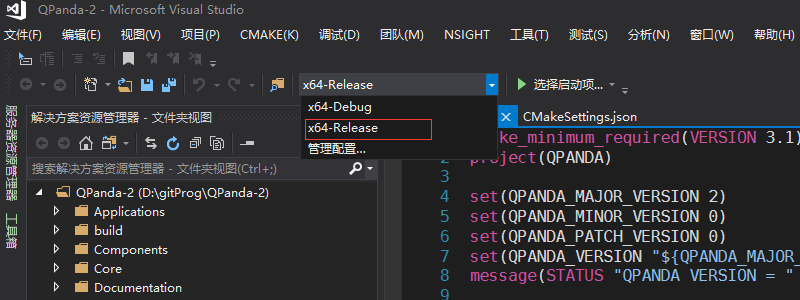
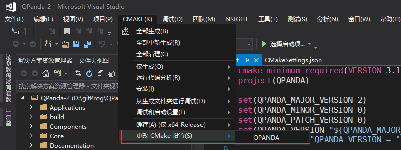
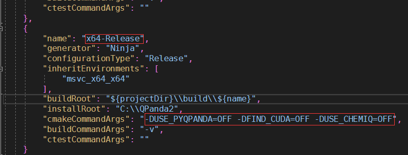
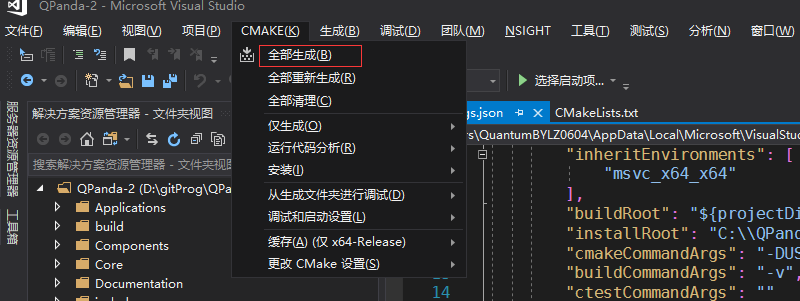
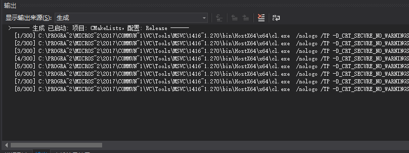
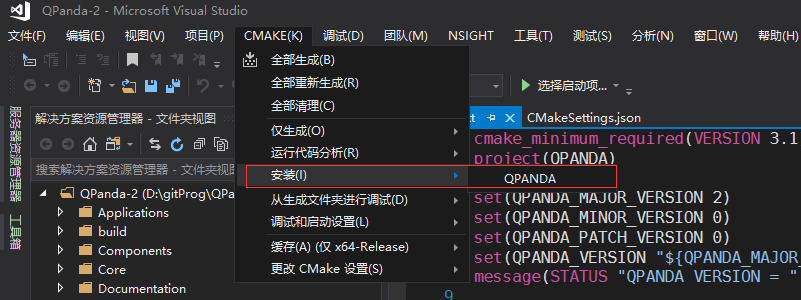

下载、编译、安装和使用
=============================

下载QPanda-2
------------------

如果在您的系统上已经安装了git， 您可以通过git来获取QPanda2：

    .. code-block:: c

        $ git clone https://github.com/OriginQ/QPanda-2.git


当然了，对于一些未安装git的伙伴来说，也可以直接通过浏览器去下载QPanda-2， 具体的操作步骤如下：

1. 在浏览器中输入 https://github.com/OriginQ/QPanda-2 ， 进入网页会看到：

.. image:: images/QPanda_github.png
    :align: center  

2. 点击 ``Clone or download`` 看到如下界面：

.. image:: images/Clone.png
    :align: center  

3. 然后点击 ``Download ZIP``， 就会完成QPanda2的下载。

.. image:: images/Download.png
    :align: center  

编译和安装
------------------

在编译QPanda2之前，可以先了解一下QPanda2的可配置项

1. ``FIND_CUDA`` : 查询系统中是否有cuda库，如果有就会将其编译进去， 在做量子计算时可以选择GPU作为计算后端
2. ``USE_CHEMIQ`` : 化学模拟库
3. ``USE_PYQPANDA`` : 编译出共python使用的pyqpanda库

*默认情况下，上述的配置项都是关闭的，如果有需要，可以在编译时选择打开*

Windows
>>>>>>>>>>>

在Windows平台下，QPanda-2支持使用Visual Studio和MinGW编译、安装。

Visual Studio 
****************

编译
`````````
这里以Visual Studio 2017为例，使用Visual Studio 2017 编译QPanda-2,只需要安装Visual Studio 2017，
并需要在组件中安装CMake组件。安装完成之后，用Visual Studio 2017打开QPanda-2文件夹。

首先，要选择x64-Release的模式下编译，按下面的提示选择：



然后, 选择更改cmake设置，查看有没有需要修改的配置项，如下:




进入cmake设置后可以看到，在默认情况下，``FIND_CUDA``、``USE_CHEMIQ``、``USE_PYQPANDA`` 都是关闭的，如果有需要可以将对应的选项中的 ``OFF`` 修改为 ``ON``



然后，点击 CMAKE选项中的 ``全部生成``



可以看到:



等待一会，就会完成编译。

安装
`````````
在QPanda-2编译完成后，用户可以安装QPanda-2，Visual Studio 2017的安装方式很简单，只需要在cmake菜单中选择安装即可。



MinGW
**********************

编译
`````````

使用MinGW编译QPanda-2，需要自行搭建CMake和MinGW环境，用户可自行在网上查询环境搭建教程。（注意： MinGW需要安装64位版本）

CMake+MinGW的编译命令如下：

1. 在QPanda-2根目录下创建build文件夹
2. 进入build文件夹，打开cmd
3. 输入下面的命令：

.. code-block:: c

    cmake -G"MinGW Makefiles" -DCMAKE_INSTALL_PREFIX=C:/QPanda2 -DFIND_CUDA=OFF -DUSE_CHEMIQ=OFF -DUSE_PYQPANDA=OFF ..
    mingw32-make

也可以根据需要，将一些可配置项设置为 ``ON``。

.. warning::

    MinGW在支持cuda有还存在一些问题，因此使用MinGW不能将 ``DFIND_CUDA`` 设置为ON。

安装
`````````

在QPanda-2编译完成后，用户可以安装QPanda-2，安装命令如下：

.. code-block:: c

    mingw32-make install

Linux 和 MacOS
>>>>>>>>>>>>>>>

环境要求
*********
- gcc/clang/（其它C++编译器）：支持C++14标准以及OpenMP
- CMake 3.0 以上
- pkg-config工具(Linux,必须。Ubuntu下使用 sudo apt-get install pkg-config 安装,CentOS下需要下载源码编译)
- UUID库（Linux，必须。Ubuntu下使用 sudo apt-get install uuid-dev 安装，CentOS下使用yum install libuuid-devel安装）
- Python 3.5 以上 (pyQPanda，可选)
- CURL (量子云连接功能，可选)
- MPI (在集群上运行量子虚拟机，可选)
- CUDA 9 以上 (在GPU上运行量子虚拟机，可选)

编译
*******

1. 进入QPanda-2根目录
2. 输入以下命令：

.. code-block:: c

    mkdir -p build
    cd build
    cmake -DFIND_CUDA=OFF -DUSE_CHEMIQ=OFF -DUSE_PYQPANDA=OFF ..
    make

如果有需求，用户通过命令修改QPanda-2的安装路径，配置方法如下所示：

.. code-block:: c

    mkdir -p build
    cd build
    cmake -DCMAKE_INSTALL_PREFIX=/usr/local -DFIND_CUDA=OFF -DUSE_CHEMIQ=OFF -DUSE_PYQPANDA=OFF ..
    make

也可以根据需求将可配置项设置为 ``ON``

安装
*******

在Linux和MacOS下安装命令QPanda-2，命令是一样的，安装命令如下：

.. code-block:: c

    sudo make install


.. note:: 

    如果想使用pyqpanda也可以通过 ``pip install pyqpanda`` 命令直接下载我们发布的库，可以避免由于系统中的环境配置有问题导致pyqpanda编译出错的问题。

使用
------------------

我们接下来通过一个示例介绍QPanda-2的使用，下面的例子可以在量子计算机中构建量子纠缠态(|00>+|11>)，对其进行测量，重复制备1000次。
预期的结果是约有50%的概率使测量结果分别在00或11上。

    .. code-block:: c

        #include "QPanda.h"
        #include <stdio.h>
        using namespace QPanda;
        int main()
        {
            init(QMachineType::CPU);
            QProg prog;
            auto q = qAllocMany(2);
            auto c = cAllocMany(2);
            prog << H(q[0])
                << CNOT(q[0],q[1])
                << MeasureAll(q, c);
            auto results = runWithConfiguration(prog, c, 1000);
            for (auto result : results){
                printf("%s : %d\n", result.first.c_str(), result.second);
            }
            finalize();
        }

示例程序的编译方式与编译QPanda库的方式基本类似，在这里就不多做赘述。我们在QPanda-2的github库中添加了 `Template <https://github.com/OriginQ/QPanda-2/tree/master/Template>`_ 文件夹，用于展示各个平台的使用案例。

在Linux环境下，用户也可以使用g++编译test.cpp，编译命令如下所示：

    .. code-block:: c

        g++ test.cpp -std=c++14 -fopenmp -I{QPanda安装路径}/include/qpanda2/ -I{QPanda安装路径}/include/qpanda2/ThirdParty/ -L{QPanda安装路径}/lib/ -lComponents -lQAlg  -lQPanda2 -lTinyXML -lantlr4  -lGPUQGates -o test

如果宿主机上安装了libcurl，则编译命令如下所示：

    .. code-block:: c

        g++ test.cpp -std=c++14 -fopenmp -I{QPanda安装路径}/include/qpanda2/ -I{QPanda安装路径}/include/qpanda2/ThirdParty/ -L{QPanda安装路径}/lib/ -lComponents -lQAlg  -lQPanda2 -lTinyXML -lantlr4  -lGPUQGates -lcurl -o test

如果安装的是可以含有CUDA的库，则编译命令如下：

    .. code-block:: c

        g++ test.cpp -std=c++14 -fopenmp  -I{QPanda安装路径}/include/qpanda2/ -I{QPanda安装路径}/include/qpanda2/ThirdParty/ -L{QPanda安装路径}/lib/ -lComponents -lQAlg  -lQPanda2 -lTinyXML -lantlr4  -lGPUQGates -L{cuda安装目录}/lib/  -lcudart  -o test


计算结果如下所示：
    
    .. code-block:: c

        00 : 493 
        11 : 507

.. note:: 

    上面只是简单介绍了QPanda2在linux下的使用教程，其他平台如windows下的VS、MinGW，MacOS下Clang调用QPanda2的方式请参照我们的示例项目 `QPanda-Example <https://github.com/OriginQ/QPanda-Example>`_ 