下载、编译、安装和使用
=============================

下载QPanda-2
------------------

您可以通过以下途径获取QPanda2：

GitHub
>>>>>>>>>>>>>>>>

1. 如果您已经在系统中安装了git， 您可以通过git来获取QPanda2：

 + 选这一个保存QPanda2的文件夹然后在文件夹内单击 ``鼠标右键`` -``Git Bash Here``

 .. image:: images/GitBashHere1.jpg
    :align: center  


 + 在弹出的窗口中输入以下命令，再按下 ``Enter`` 键，然后静待下载完成即可：

 .. code-block:: c

    git clone https://github.com/OriginQ/QPanda-2.git
    
 .. image:: images/GitBashHere3.jpg
    :align: center  


2.当然了，对于一些未安装git的伙伴来说，也可以直接通过浏览器去下载QPanda-2， 具体的操作步骤如下：

 + 在浏览器中输入： https://github.com/OriginQ/QPanda-2 ， 进入网页会看到：

 .. image:: images/QPanda_github.jpg
    :align: center  

 + 点击 ``Code`` 看到如下界面：

 .. image:: images/Code_Clone.jpg
    :align: center  

 + 然后点击 ``Download ZIP``， 就会完成QPanda2的下载。

 .. image:: images/Download.jpg
    :align: center  

Gitee
>>>>>>>>>>>>>>>>

1. 同 :ref:`GitHub` ，如果在您的系统上已经安装了git，您只需要将输入变成以下命令即可：

 .. code-block:: c

    git clone https://gitee.com/OriginQ/QPanda-2.git
 

 .. image:: images/gitee.jpg
    :align: center  


2. 直接通过浏览器下载QPanda-2， 具体的操作步骤与 :ref:`GitHub` 类似。

 在浏览器中输入 https://gitee.com/OriginQ/QPanda-2?_from=gitee_search ，打开后，依次单击 ``克隆/下载`` - ``下载ZIP`` 即可开始下载QPanda2。

 .. image:: images/gitee1.jpg
    :align: center  

编译和安装
------------------

在编译QPanda2之前，可以先了解一下QPanda2的可配置项：

1. ``FIND_CUDA`` : 查询系统中是否有cuda库，如果有就会将其编译进去， 在做量子计算时可以选择GPU作为计算后端
2. ``USE_CHEMIQ`` : 化学模拟库
3. ``USE_PYQPANDA`` : 编译出供python使用的pyqpanda库

*默认情况下，上述的配置项都是关闭的，如果有需要，可以在编译时选择打开*

.. note::
    如需使用本源量子云服务，请在安装QPanda之前下载安装 `curl库 <https://curl.se/download.html>`_ 。

Windows
>>>>>>>>>>>

在Windows平台下，QPanda-2支持使用Visual Studio和MinGW编译、安装。

Visual Studio 
****************

编译
`````````
这里以Visual Studio 2017为例，使用Visual Studio 2017 编译QPanda-2,只需要安装Visual Studio 2017，
并需要在组件中安装CMake组件。安装完成之后，用Visual Studio 2017打开QPanda-2文件夹。

首先，要选择x64-Release的模式下编译，按下面的提示选择：

.. image:: images/CMakeRelease.png
    :align: center 

然后, 选择更改cmake设置，查看有没有需要修改的配置项，如下:

.. image:: images/CMakeSetting.png
    :align: center 


进入cmake设置后可以看到，在默认情况下，``FIND_CUDA``、``USE_CHEMIQ``、``USE_PYQPANDA`` 都是关闭的，如果有需要可以将对应的选项中的 ``OFF`` 修改为 ``ON``

.. image:: images/CMakeOptional.png
    :align: center

然后，点击 CMAKE选项中的 ``全部生成``

.. image:: images/BuildAll.png
    :align: center 

可以看到:

.. image:: images/CMakeCompiling.png
    :align: center 

等待一会，就会完成编译。

安装
`````````
在QPanda-2编译完成后，用户可以安装QPanda-2，Visual Studio 2017的安装方式很简单，只需要在cmake菜单中选择安装即可。

.. image:: images/CMakeInstall.png
    :align: center   

MinGW
**********************

编译
`````````

使用MinGW编译QPanda-2，需要自行搭建CMake和MinGW环境，用户可自行在网上查询环境搭建教程。（注意： MinGW需要安装64位版本）

CMake+MinGW的编译命令如下：

1. 在QPanda-2根目录下创建build文件夹
   
2. 进入build文件夹，可以按住 ``Shift`` + ``鼠标右键`` ，然后选择 ``在此处打开命令窗口(w)`` 或 ``在此处打开PowerShell窗口(s)`` 快捷打开cmd或PowerShell。
  
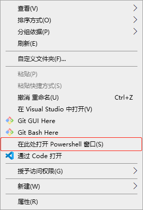

3. 输入下面的命令：

.. code-block:: c

    cmake -G"MinGW Makefiles" -DCMAKE_INSTALL_PREFIX=C:/QPanda2 -DFIND_CUDA=OFF -DUSE_CHEMIQ=OFF -DUSE_PYQPANDA=OFF ..
    mingw32-make

也可以根据需要，将一些可配置项设置为 ``ON``。

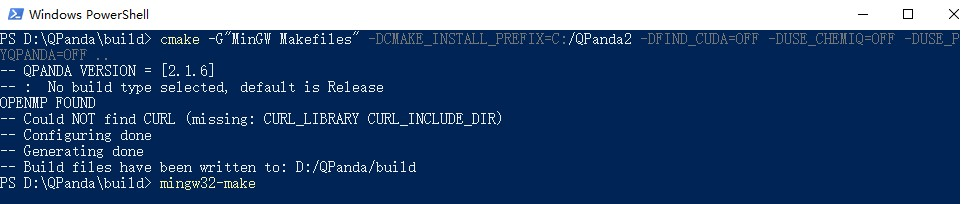

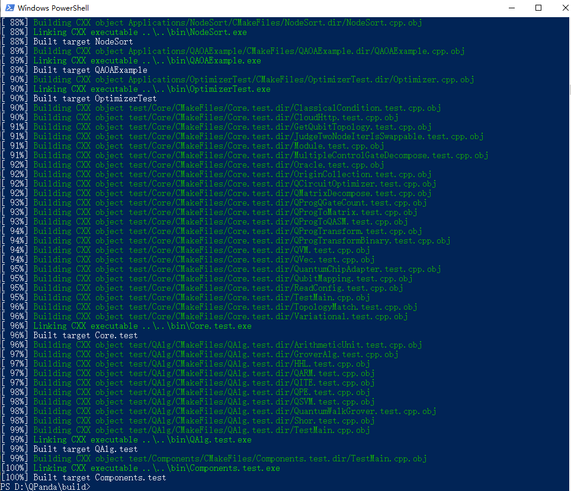

.. warning::

    MinGW在支持cuda有还存在一些问题，因此使用MinGW不能将 ``DFIND_CUDA`` 设置为 ``ON`` 。

安装
`````````

在QPanda-2编译完成后，用户可以安装QPanda-2，安装命令如下：

.. code-block:: c

    mingw32-make install

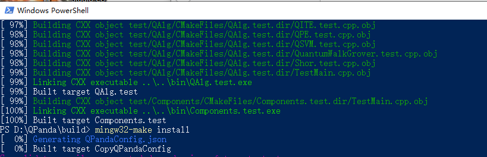

    

Linux 和 MacOS
>>>>>>>>>>>>>>>

环境要求
**********************

- gcc/clang/（其它C++编译器）：支持C++14标准以及OpenMP
- CMake 3.0 以上
- pkg-config工具(Linux,必须。Ubuntu下使用 sudo apt-get install pkg-config 安装,CentOS下需要下载源码编译)
- UUID库（Linux，必须。Ubuntu下使用 sudo apt-get install uuid-dev 安装，CentOS下使用yum install libuuid-devel安装）
- Python 3.5 以上 (pyQPanda，可选)
- CURL (量子云连接功能，可选)
- MPI (在集群上运行量子虚拟机，可选)
- CUDA 9 以上 (在GPU上运行量子虚拟机，可选)


编译
**********************

1. 进入QPanda-2根目录

2. 输入以下命令：

.. code-block:: c

    mkdir -p build
    cd build
    cmake -DFIND_CUDA=OFF -DUSE_CHEMIQ=OFF -DUSE_PYQPANDA=OFF ..
    make

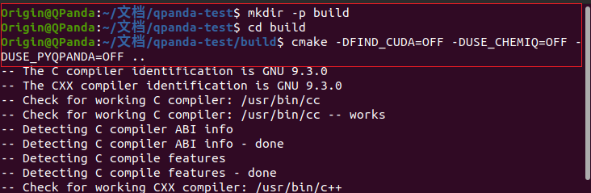


如果有需求，用户通过命令修改QPanda-2的安装路径，配置方法如下所示：

.. code-block:: c

    mkdir -p build
    cd build
    cmake -DCMAKE_INSTALL_PREFIX=/usr/local -DFIND_CUDA=OFF -DUSE_CHEMIQ=OFF -DUSE_PYQPANDA=OFF ..
    make

也可以根据需求将可配置项设置为 ``ON``

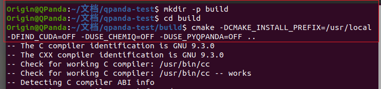

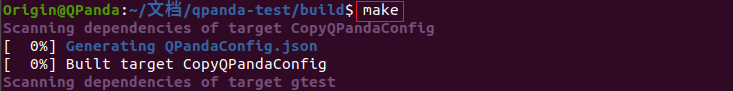

安装
**********************

在Linux和MacOS下安装命令QPanda-2，命令是一样的，安装命令如下：

.. code-block:: c

    sudo make install

.. image:: images/install.png
    :align: center 

.. note:: 

    如果想使用pyqpanda也可以通过 ``pip install pyqpanda`` 命令直接下载我们发布的库，可以避免由于系统中的环境配置有问题导致pyqpanda编译出错的问题。
    
    **本文档中QPanda2安装目录：**

    - Windows下为：``C:\QPanda2\``
    - Linux下为：``/usr/local``
    - MacOS下为：``/usr/local``


使用
------------------

我们接下来通过一个示例介绍QPanda-2的使用，下面的例子可以在量子计算机中构建量子纠缠态(|00>+|11>)，对其进行测量，重复制备1000次。
预期的结果是约有50%的概率使测量结果分别在00或11上。

    .. code-block:: c

        #include "QPanda.h"
        USING_QPANDA

        int main()
        {
            // 初始化量子虚拟机
            init(QMachineType::CPU);
            
            // 申请量子比特以及经典寄存器
            auto q = qAllocMany(2);
            auto c = cAllocMany(2);
           
            // 构建量子程序
            QProg prog;
            prog << H(q[0])
                << CNOT(q[0],q[1])
                << MeasureAll(q, c);
            
            // 量子程序运行1000次，并返回测量结果
            auto results = runWithConfiguration(prog, c, 1000);

            // 打印量子态在量子程序多次运行结果中出现的次数
            for (auto &val: results)
            {
                std::cout << val.first << ", " << val.second << std::endl;
            }

            // 释放量子虚拟机
            finalize();

            return 0;
        }

    计算结果如下所示：
    
    .. code-block:: c
    
            00 : 493 
            11 : 507
    
示例程序的编译方式与编译QPanda库的方式基本类似。我们在QPanda-2的github库中添加了 `Template <https://github.com/OriginQ/QPanda-2/tree/master/Template>`_ 文件夹，用于展示各个平台的使用案例。

下面将简单介绍一下QPanda2在Windows、linux、MacOS下的使用教程：

Windows
>>>>>>>>>

Visual Studio
**********************

visual studio 2017 下链接QPanda库需要配置QPanda的头文件地址和QPanda库的地址，下面以GateTypeValidator项目为例：

1. 选择中GateTypeValidator项目,右键选中属性。
 
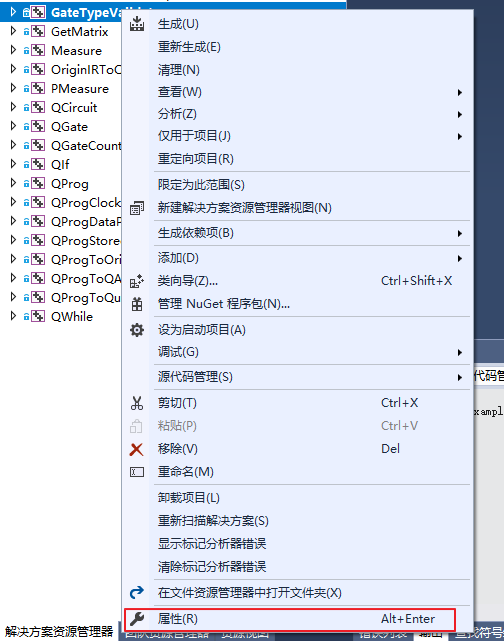

2. 在设置visual studio 2017项目属性时，一定要注意配置管理器中的Release和Debug、及x64要与项目所选的相同（QPanda2不支持x86平台）。

 .. image:: images/ConfigurationManager.png
       :align: center    

3. 设置附加包含目录，选中C/C++ -> 所有选项 -> 附加包含目录，设置两个路径：${QPanda的安装路径}/include/qpanda2;${QPanda的安装路径}/include/qpanda2/ThirdParty

 .. image:: images/IncludePath.png
    :align: center 

 如果使用的QPanda2库是包含GPU计算部分的时候还需要添加cuda头文件的安装路径，设置的路径为：${QPanda的安装路径}/include/qpanda2;${QPanda的安装路径}/include/qpanda2/ThirdParty;${CUDA库的路径}/include
 
 .. image:: images/CudaIncludePath.png
    :align: center 

4. 设置运行库, 选中C/C++ -> 所有选项 -> 运行库，设置为MT
 
 .. image:: images/MT.png
    :align: center 

5. 设置库目录 ,选中链接器 -> 常规 -> 附加库目录，只需要设置lib路径卫：${QPanda的安装路径}/lib
 
 .. image:: images/LibPath.png
    :align: center 

 如果使用的QPanda2库是包含GPU计算部分的时候还需要添加cuda库的安装路径，设置的路径为：${QPanda的安装路径}/lib;${CUDA库的路径}/lib/x64
 
 .. image:: images/CudaLibPath.png
    :align: center 

6. 设置附加依赖项,选中链接器 -> 输入 -> 附加依赖项，设置以下依赖库：antlr4.lib;Components.lib;QAlg.lib;QPanda2.lib

 
 .. image:: images/LoadLibs.png
    :align: center 

 包含GPU计算方式还需要添加下面两个库： GPUQGates.lib;cudart.lib
 
 .. image:: images/CudaLoadLibs.png
    :align: center 

7. 设置符合模式，选中C/C++- > 语言 -> 符合模式，设置为否

 .. image:: images/LanguageModel.png
    :align: center 

.. note:: 

    按照上述操作完成后，如若报错：LNK2001，可尝试以下操作：

    选中C/C++- > 所有选项 -> 预处理器定义，删除 ``_DEBUG;`` ：
    
    .. image:: images/errorhandling.jpg
        :align: center

MinGW
********************

1. 可以使用如下命令编译：

.. code-block:: c

    g++ test.cpp -std=c++14 -fopenmp -I{QPanda安装路径}/include/qpanda2/ -I{QPanda安装路径}/include/qpanda2/ThirdParty/ -L{QPanda安装路径}/lib/ -lQPanda2 -lantlr4 -o test

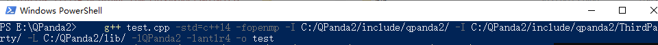
 
示例运行结果如下：

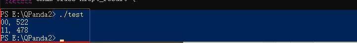

2. 也可以使用MinGW+CMake使用如下命令编译：

.. code-block:: c

    cd test
    mkdir -p build
    cd build
    cmake -G"MinGW Makefiles" -DQPANDA_INSTALL_DIR=C:/QPanda2/ ..
    mingw32-make

.. image:: images/mingw+cmake.jpg
    :align: center

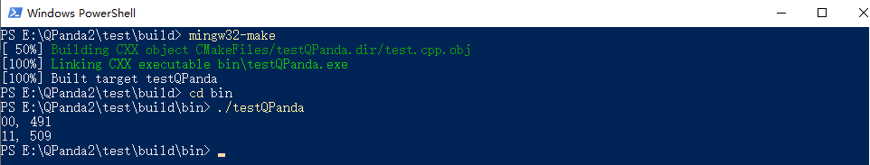

CMakelists配置为:

.. code-block:: c

    #指定 cmake 的最小版本
    cmake_minimum_required(VERSION 3.1)
    #设置项目名称
    project(testQPanda)
    # 定义自己的 cmake 模块所在的路径
    set(CMAKE_MODULE_PATH ${CMAKE_MODULE_PATH} "${QPANDA_INSTALL_DIR}/lib/cmake")
    #指定C++版本
    set(CMAKE_CXX_STANDARD 14)

    #设置 C++ 编译选项
    add_definitions("-w -DGTEST_USE_OWN_TR1_TUPLE=1")
    set(CMAKE_BUILD_TYPE "Release")
    set(CMAKE_CXX_FLAGS_DEBUG "$ENV{CXXFLAGS} -O0 -g -ggdb")
    set(CMAKE_CXX_FLAGS_RELEASE "$ENV{CXXFLAGS} -O3")
    add_compile_options(-fpermissive)

    #重新定义目标链接库文件的存放位置
    set(LIBRARY_OUTPUT_PATH ${PROJECT_BINARY_DIR}/lib)
    #重新定义目标二进制可执行文件的存放位置
    set(EXECUTABLE_OUTPUT_PATH ${PROJECT_BINARY_DIR}/bin)
    #引入外部依赖包
    find_package(QPANDA REQUIRED)
    include_directories(${QPANDA_INCLUDE_DIR})
    # 生成可执行文件
    add_executable(${PROJECT_NAME} test.cpp)
    target_link_libraries(${PROJECT_NAME} ${QPANDA_LIBRARIES})


CMake
********************

可以使用CMake的方式调用QPanda2库编译生成可执行文件。由于VS的版本比较多，不同的版本使用CMake会有一些差距，这里就以Virsual Studio 2017为例

1. 首先打开VS，选中 文件->打开->CMake

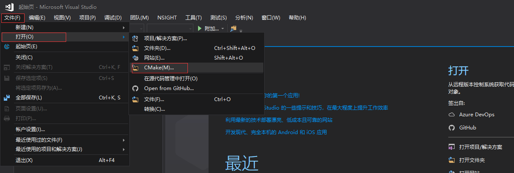


vs_cmake.png
2. 然后选择QPanda-example文件夹中的示例下的CMakeLists.txt点击，就会打开一个示例

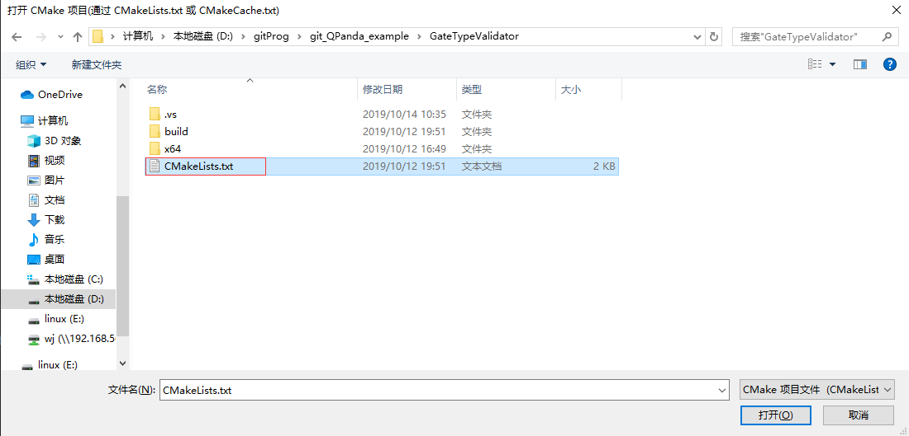


3. 再选择CMakeSetting.json文件，修改-DQPANDA_INSTALL_DIR={QPanda2安装目录}

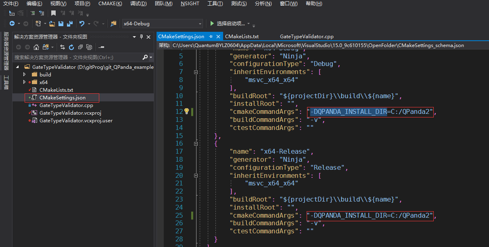


4. 修改后，ctrl+s，选择CMAKE->全部生成

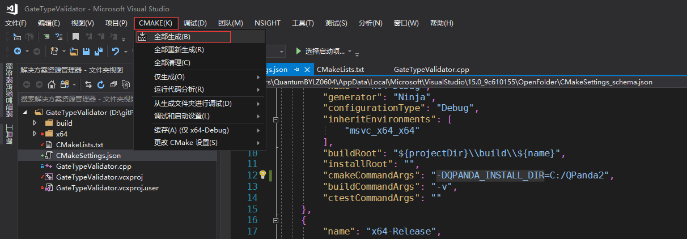


5. 点击图中的下拉小箭头，选择可执行程序

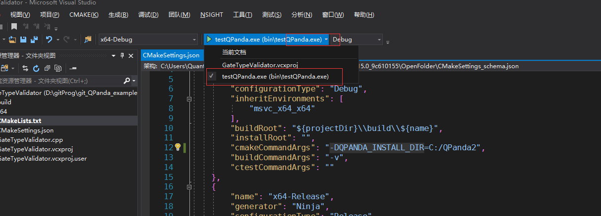


上面介绍了使用cmake打开我们构建好的工程，有兴趣的也可以深入的学习使用cmake构建项目。

vs下的CMakelists配置:

.. code-block:: c

    cmake_minimum_required(VERSION 3.1)
    project(testQPanda)
    set(CMAKE_MODULE_PATH ${CMAKE_MODULE_PATH} "${QPANDA_INSTALL_DIR}/lib/cmake")

    set(CMAKE_CXX_STANDARD 14)
    if (MSVC)
        list(APPEND EXTRA_LDFLAGS
            -D_SILENCE_TR1_NAMESPACE_DEPRECATION_WARNING
            -D_CRT_SECURE_NO_WARNINGS
            /bigobj)

        if (NOT USE_MSVC_RUNTIME_LIBRARY_DLL)
            foreach (flag
                CMAKE_C_FLAGS
                CMAKE_C_FLAGS_DEBUG
                CMAKE_C_FLAGS_RELEASE
                CMAKE_C_FLAGS_MINSIZEREL
                CMAKE_C_FLAGS_RELWITHDEBINFO
                CMAKE_CXX_FLAGS
                CMAKE_CXX_FLAGS_DEBUG
                CMAKE_CXX_FLAGS_RELEASE
                CMAKE_CXX_FLAGS_MINSIZEREL
                CMAKE_CXX_FLAGS_RELWITHDEBINFO)

                if (${flag} MATCHES "/MDd")
                    string(REGEX REPLACE "/MDd" "/MT" ${flag} "${${flag}}")
                endif()

                if (${flag} MATCHES "/MD")
                    string(REGEX REPLACE "/MD" "/MT" ${flag} "${${flag}}")
                endif()

                if (${flag} MATCHES "/W3")
                    string(REGEX REPLACE "/W3" "/W0" ${flag} "${${flag}}")
                endif()
            endforeach()
        endif()
    endif()

    set(LIBRARY_OUTPUT_PATH ${PROJECT_BINARY_DIR}/lib)
    set(EXECUTABLE_OUTPUT_PATH ${PROJECT_BINARY_DIR}/bin)

    find_package(QPANDA REQUIRED)
    include_directories(${QPANDA_INCLUDE_DIR})

    add_executable(${PROJECT_NAME} GateTypeValidator.cpp)
    target_link_libraries(${PROJECT_NAME} ${QPANDA_LIBRARIES})

Linux
>>>>>>>>>

gcc
********************

在Linux环境下，用户也可以使用g++编译test.cpp，编译命令如下所示：

    .. code-block:: c

        g++ test.cpp -std=c++14 -fopenmp -I{QPanda安装路径}/include/qpanda2/ -I{QPanda安装路径}/include/qpanda2/ThirdParty/ -L{QPanda安装路径}/lib/ -lComponents -lQAlg  -lQPanda2 -lantlr4 -o test

    .. image:: images/gcc.png
        :align: center 

如果宿主机上安装了libcurl，则编译命令如下所示：

    .. code-block:: c

        g++ test.cpp -std=c++14 -fopenmp -I{QPanda安装路径}/include/qpanda2/ -I{QPanda安装路径}/include/qpanda2/ThirdParty/ -L{QPanda安装路径}/lib/ -lComponents -lQAlg  -lQPanda2 -lantlr4 -lcurl -o test

    .. image:: images/gcc_libcurl.png
        :align: center 

如果安装的是可以含有CUDA的库，则编译命令如下：

    .. code-block:: c

        g++ test.cpp -std=c++14 -fopenmp  -I{QPanda安装路径}/include/qpanda2/ -I{QPanda安装路径}/include/qpanda2/ThirdParty/ -L{QPanda安装路径}/lib/ -lComponents -lQAlg  -lQPanda2 -lantlr4  -lGPUQGates -L{cuda安装目录}/lib/  -lcudart  -o test

    .. image:: images/gcc_CUDA.jpg
        :align: center 

.. note:: 

    如遇以下错误：

    .. image:: images/linux_cuda_error.png
        :align: center 
   
    可以使用如下方法解决（样例CUDA版本为11.2）：
    
    .. code-block:: c

        sudo ldconfig /usr/local/cuda-11.2/lib64


CMake
********************

在Linux环境下，用户也可以使用CMake编译test.cpp，编译命令如下所示(以QPanda-example文件夹中的GateTypeValidator示例)：
        
.. code-block:: c

    cd GateTypeValidator
    mkdir -p build
    cd build
    cmake -DQPANDA_INSTALL_DIR=/usr/local/ ..   #本文档样例QPanda的路径是/usr/local/
    make
     
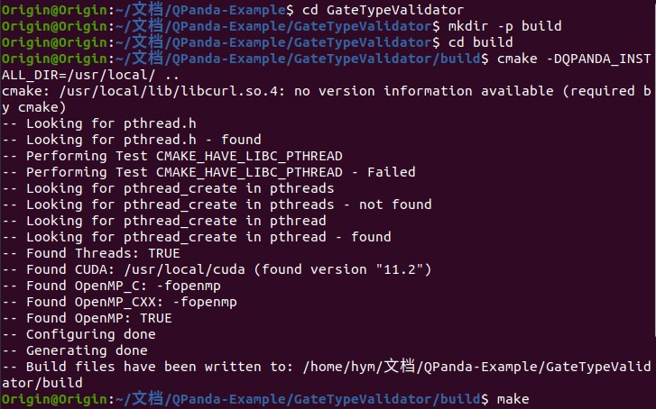

运行编译后文件：

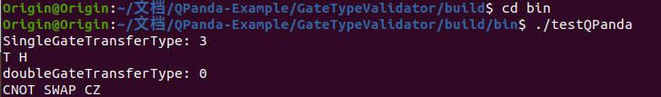

Linux下的CMakelists配置:

    .. code-block:: c

        #指定 cmake 的最小版本
        cmake_minimum_required(VERSION 3.1)
        #设置项目名称
        project(testQPanda)
        # 定义自己的 cmake 模块所在的路径
        set(CMAKE_MODULE_PATH ${CMAKE_MODULE_PATH} "${QPANDA_INSTALL_DIR}/lib/cmake")
        #指定C++版本
        set(CMAKE_CXX_STANDARD 14)
        
        #设置 C++ 编译选项
        add_definitions("-w -DGTEST_USE_OWN_TR1_TUPLE=1")
        set(CMAKE_BUILD_TYPE "Release")
        set(CMAKE_CXX_FLAGS_DEBUG "$ENV{CXXFLAGS} -O0 -g -ggdb")
        set(CMAKE_CXX_FLAGS_RELEASE "$ENV{CXXFLAGS} -O3")
        add_compile_options(-fpermissive)
        
        #重新定义目标链接库文件的存放位置
        set(LIBRARY_OUTPUT_PATH ${PROJECT_BINARY_DIR}/lib)
        #重新定义目标二进制可执行文件的存放位置
        set(EXECUTABLE_OUTPUT_PATH ${PROJECT_BINARY_DIR}/bin)
        #引入外部依赖包
        find_package(QPANDA REQUIRED)
        include_directories(${QPANDA_INCLUDE_DIR})
        # 生成可执行文件
        add_executable(${PROJECT_NAME} test.cpp)
        target_link_libraries(${PROJECT_NAME} ${QPANDA_LIBRARIES})


MacOS
>>>>>>>>>

Clang
********************

在MacOS环境下，用户可以使用Clang编译test.cpp，编译命令如下所示：

.. code-block:: c

    clang++ test.cpp -std=c++14 -fopenmp -I{QPanda安装路径}/include/qpanda2/ -I{QPanda安装路径}/include/qpanda2/ThirdParty/ -L{QPanda安装路径}/lib/ -lQPanda2 -lComponents -lantlr4 -o test


含有CUDA的编译指令

.. code-block:: c

    clang++ test.cpp -std=c++14 -fopenmp -I{QPanda安装路径}/include/qpanda2/ -I{QPanda安装路径}/include/qpanda2/ThirdParty/ -L{QPanda安装路径}/lib/ -lQPanda2 -lComponents -lantlr4 -lGPUQGates -L{CUDA安装路径}/lib/  -lcudart -o test

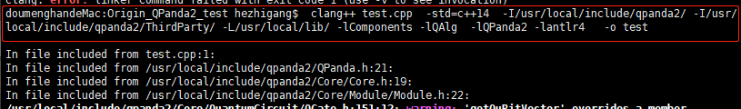

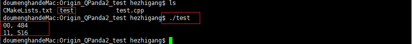

CMake
********************

在MacOS环境下，用户也可以使用CMake编译test.cpp，编译命令如下所示：

.. code-block:: c

    cd test
    mkdir -p build
    cd build
    cmake -DQPANDA_INSTALL_DIR=/usr/local/ .. #本文档样例QPanda的路径是/usr/local/
    make

.. image:: images/cmake.jpg
    :align: center   

运行编译后文件：
.. image:: images/cmake_result.jpg
    :align: center   

MacOS下的CMakelists配置:

.. code-block:: c

    #指定 cmake 的最小版本
    cmake_minimum_required(VERSION 3.1)
    #设置项目名称
    project(testQPanda)
    # 定义自己的 cmake 模块所在的路径
    set(CMAKE_MODULE_PATH ${CMAKE_MODULE_PATH} "${QPANDA_INSTALL_DIR}/lib/cmake")
    #指定C++版本
    set(CMAKE_CXX_STANDARD 14)

    #设置 C++ 编译选项
    add_definitions("-w -DGTEST_USE_OWN_TR1_TUPLE=1")
    set(CMAKE_BUILD_TYPE "Release")
    set(CMAKE_CXX_FLAGS_DEBUG "$ENV{CXXFLAGS} -O0 -g -ggdb")
    set(CMAKE_CXX_FLAGS_RELEASE "$ENV{CXXFLAGS} -O3")
    add_compile_options(-fpermissive)

    #重新定义目标链接库文件的存放位置
    set(LIBRARY_OUTPUT_PATH ${PROJECT_BINARY_DIR}/lib)
    #重新定义目标二进制可执行文件的存放位置
    set(EXECUTABLE_OUTPUT_PATH ${PROJECT_BINARY_DIR}/bin)
    #引入外部依赖包
    find_package(QPANDA REQUIRED)
    include_directories(${QPANDA_INCLUDE_DIR})
    # 生成可执行文件
    add_executable(${PROJECT_NAME} test.cpp)
    target_link_libraries(${PROJECT_NAME} ${QPANDA_LIBRARIES})

.. note::

    其他样例请参照我们的示例项目  `QPanda-Example <https://github.com/OriginQ/QPanda-Example>`_ 